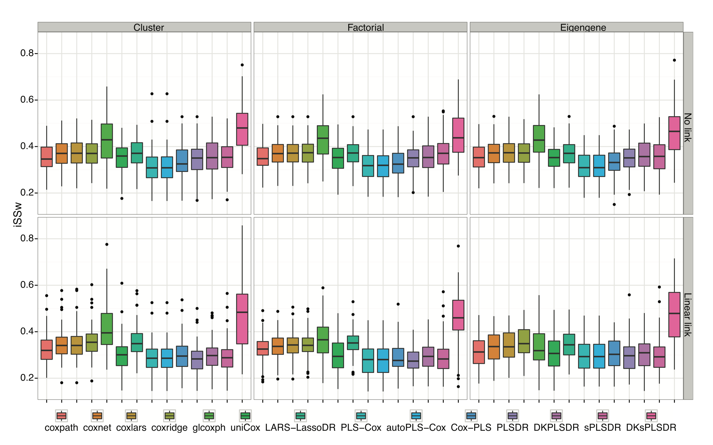
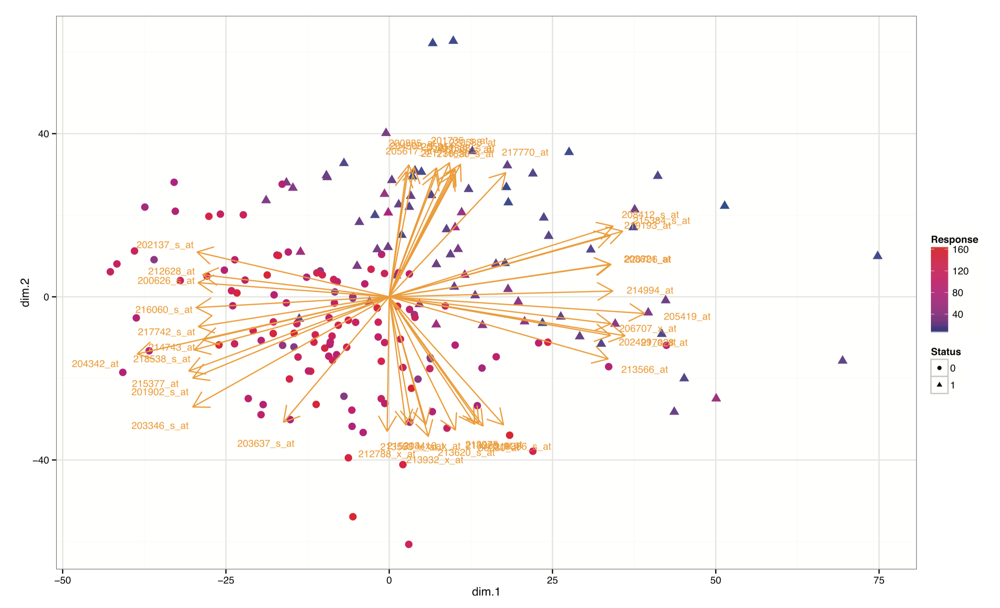
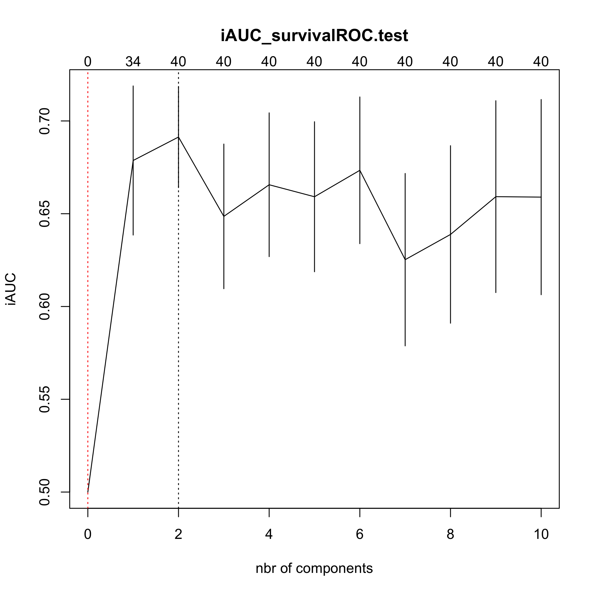
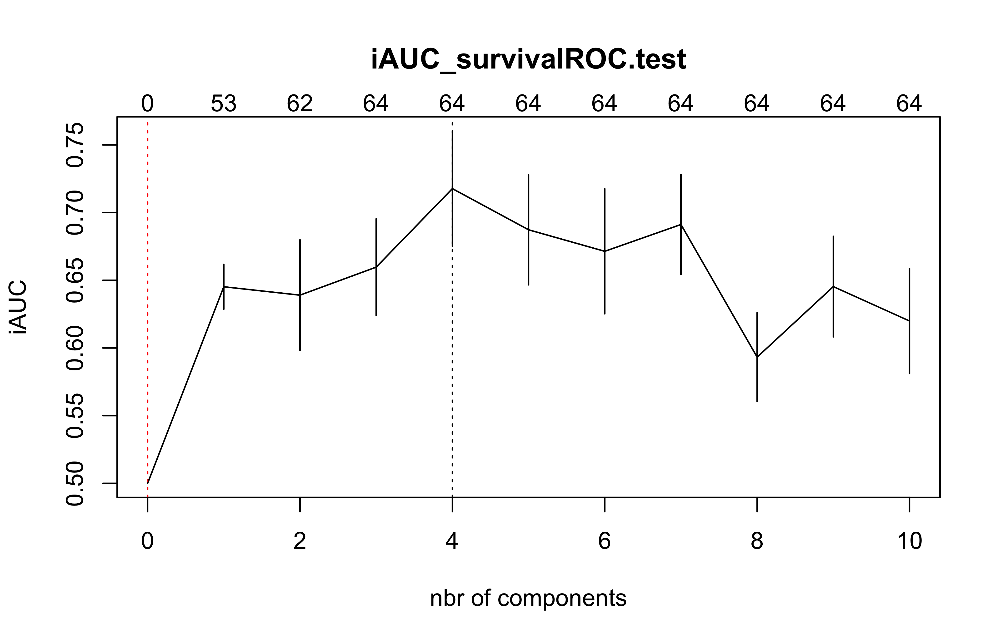
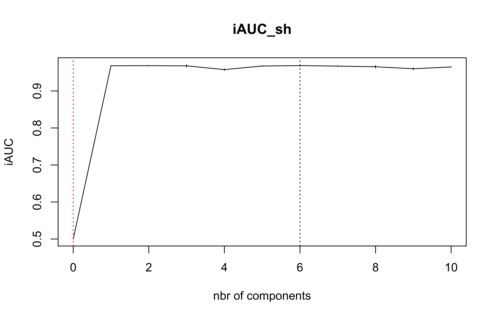

<!-- README.md is generated from README.Rmd. Please edit that file -->


# plsRcox 

# plsRcox, Cox-Models in a High Dimensional Setting in R
## Frédéric Bertrand and Myriam Maumy-Bertrand

<https://doi.org/10.32614/CRAN.package.plsRcox>

<!-- badges: start -->
[](https://doi.org/10.32614/CRAN.package.plsRcox)
[](https://lifecycle.r-lib.org/articles/stages.html)
[](https://www.repostatus.org/#active)
[](https://github.com/fbertran/plsRcox/actions)
[](https://app.codecov.io/gh/fbertran/plsRcox?branch=master)
[](https://cran.r-project.org/package=plsRcox)
[](https://cran.r-project.org/package=plsRcox)
[](https://github.com/fbertran/plsRcox)
<!-- badges: end -->


The goal of plsRcox is provide Cox models in a high dimensional setting in R.


plsRcox implements partial least squares Regression and various regular, sparse or kernel, techniques for fitting Cox models in high dimensional settings <https://doi.org/10.1093/bioinformatics/btu660>, Bastien, P., Bertrand, F., Meyer N., Maumy-Bertrand, M. (2015), Deviance residuals-based sparse PLS and sparse kernel PLS regression for censored data, Bioinformatics, 31(3):397-404. Cross validation criteria were studied in [<arXiv:1810.02962>](https://arxiv.org/abs/1810.01005), Bertrand, F., Bastien, Ph. and Maumy-Bertrand, M. (2018), Cross validating extensions of kernel, sparse or regular partial least squares regression models to censored data.


The package was presented at the [User2014!](https://user2014.r-project.org/) conference. Frédéric Bertrand, Philippe Bastien, Nicolas Meyer and Myriam Bertrand (2014). "plsRcox, Cox-Models in a high dimensional setting in R", *book of abstracts*, User2014!, Los Angeles, page 177,
<https://user2014.r-project.org/abstracts/posters/177_Bertrand.pdf>.


The plsRcox package contains an original allelotyping dataset from "Allelotyping identification of genomic alterations in rectal chromosomally unstable tumors without preoperative treatment", Benoît Romain, Agnès Neuville, Nicolas Meyer, Cécile Brigand, Serge Rohr, Anne Schneider, Marie-Pierre Gaub and Dominique Guenot (2010), *BMC Cancer*, **10**:561, <https://doi.org/10.1186/1471-2407-10-561>.


Support for parallel computation and GPU is being developped.


The package provides several modelling techniques related to penalized Cox models or extensions of partial least squares to Cox models. The first two were new algorithms.

- **coxsplsDR** and **cv.coxsplsDR** (Philippe Bastien, Frederic Bertrand, Nicolas Meyer, and Myriam Maumy-Bertrand (2015), "Deviance residuals-based sparse PLS and sparse kernel PLS regression for censored data", *Bioinformatics*, **31**(3):397-404, <https://doi.org/10.1093/bioinformatics/btu660>),

- **coxDKsplsDR** and **cv.coxDKsplsDR** (Philippe Bastien, Frederic Bertrand, Nicolas Meyer, and Myriam Maumy-Bertrand (2015), "Deviance residuals-based sparse PLS and sparse kernel PLS regression for censored data", *Bioinformatics*, **31**(3):397-404, <https://doi.org/10.1093/bioinformatics/btu660>),

- **coxDKplsDR** and **cv.coxDKplsDR** (Philippe Bastien (2008), "Deviance residuals based PLS regression for censored data in high dimensional setting", *Chemometrics and Intelligent Laboratory Systems*, **91**:78–86, <https://doi.org/10.1016/j.chemolab.2007.09.009>),

- **coxpls** and **cv.coxpls** (Nguyen, D.V., Rocke, D.M. (2002), "Partial least squares proportional hazard regression for application to DNA microarray survival data", *Bioinformatics*, **18**(12):1625–1632),

- **coxplsDR** and **cv.coxplsDR** (Philippe Bastien (2008), "Deviance residuals based PLS regression for censored data in high dimensional setting", *Chemometrics and Intelligent Laboratory Systems*, **91**:78–86, <https://doi.org/10.1016/j.chemolab.2007.09.009>),

- **DKplsRcox**,

- **larsDR** and **cv.larsDR** (Segal, M.R. (2006), "Microarray Gene Expression Data with Linked Survival Phenotypes: Diffuse large-B- Cell Lymphoma Revisited", *Biostatistics*, **7**:268-285, <https://doi.org/10.1093/biostatistics/kxj006>),

- **plsRcox** and **cv.plsRcox** (Philippe Bastien, Vincenzo Esposito Vinzi, and Michel Tenenhaus (2005), "PLS generalised linear regression", *Computational Statistics & Data Analysis*, **48**(1):17–46, <https://doi.org/10.1016/j.csda.2004.02.005>),

- **autoplsRcox** and **cv.autoplsRcox** (Philippe Bastien, Vincenzo Esposito Vinzi, and Michel Tenenhaus (2005), "PLS generalised linear regression", *Computational Statistics & Data Analysis*, **48**(1):17–46, <https://doi.org/10.1016/j.csda.2004.02.005>),







This website and these examples were created by F. Bertrand and M. Maumy-Bertrand.

## Installation

You can install the released version of plsRcox from [CRAN](https://CRAN.R-project.org) with:


``` r
install.packages("plsRcox")
```

You can install the development version of plsRcox from [github](https://github.com) with:


``` r
devtools::install_github("fbertran/plsRcox")
```

## Example

### The original allelotyping dataset


``` r
library(plsRcox)
data(micro.censure)
Y_train_micro <- micro.censure$survyear[1:80]
C_train_micro <- micro.censure$DC[1:80]
Y_test_micro <- micro.censure$survyear[81:117]
C_test_micro <- micro.censure$DC[81:117]

data(Xmicro.censure_compl_imp)
X_train_micro <- apply((as.matrix(Xmicro.censure_compl_imp)),FUN="as.numeric",MARGIN=2)[1:80,]
X_train_micro_df <- data.frame(X_train_micro)
```

Compute deviance residuals with some options.


``` r
DR_coxph(Y_train_micro,C_train_micro,plot=TRUE)
```

<div class="figure">

<p class="caption">plot of chunk devianceresiduals</p>
</div>

```
#>           1           2           3           4           5           6 
#> -1.48432960 -0.54695398 -0.23145502 -0.34003013 -0.97633722 -0.38667660 
#>           7           8           9          10          11          12 
#> -0.38667660  1.57418914 -0.54695398 -0.15811388  2.10405254 -0.23145502 
#>          13          14          15          16          17          18 
#> -0.38667660 -1.09692040 -0.15811388 -0.15811388 -0.54695398 -0.38667660 
#>          19          20          21          22          23          24 
#>  0.65978609 -1.09692040 -0.43627414 -0.28961087 -0.38667660 -0.97633722 
#>          25          26          27          28          29          30 
#> -1.09692040 -0.15811388 -0.43627414 -0.43627414 -0.38667660 -0.23145502 
#>          31          32          33          34          35          36 
#>  2.30072697 -0.49023986 -0.54695398 -0.73444882  1.31082939 -0.97633722 
#>          37          38          39          40          41          42 
#>  1.70134282 -0.54695398 -0.15811388  1.07714870 -0.15811388 -0.49023986 
#>          43          44          45          46          47          48 
#> -0.34003013 -0.97633722 -0.15811388 -0.91410465 -1.09692040 -0.43627414 
#>          49          50          51          52          53          54 
#> -0.38667660 -0.09836581 -0.79392956  0.46851068 -0.34003013  1.95366297 
#>          55          56          57          58          59          60 
#>  2.60558118 -0.54695398 -1.09692040 -0.15811388 -0.49023986 -0.97633722 
#>          61          62          63          64          65          66 
#> -0.28961087  1.44879795  1.82660327 -0.38667660  0.96936094 -0.15811388 
#>          67          68          69          70          71          72 
#> -0.43627414 -0.49023986  1.18850436 -0.97633722 -0.97633722  0.86322194 
#>          73          74          75          76          77          78 
#> -0.43627414 -0.49023986 -0.38667660  0.76231394 -0.97633722 -0.43627414 
#>          79          80 
#> -0.54695398 -0.43627414
```

``` r
DR_coxph(Y_train_micro,C_train_micro,scaleY=FALSE,plot=TRUE)
```

<div class="figure">

<p class="caption">plot of chunk devianceresiduals2</p>
</div>

```
#>           1           2           3           4           5           6 
#> -1.48432960 -0.54695398 -0.23145502 -0.34003013 -0.97633722 -0.38667660 
#>           7           8           9          10          11          12 
#> -0.38667660  1.57418914 -0.54695398 -0.15811388  2.10405254 -0.23145502 
#>          13          14          15          16          17          18 
#> -0.38667660 -1.09692040 -0.15811388 -0.15811388 -0.54695398 -0.38667660 
#>          19          20          21          22          23          24 
#>  0.65978609 -1.09692040 -0.43627414 -0.28961087 -0.38667660 -0.97633722 
#>          25          26          27          28          29          30 
#> -1.09692040 -0.15811388 -0.43627414 -0.43627414 -0.38667660 -0.23145502 
#>          31          32          33          34          35          36 
#>  2.30072697 -0.49023986 -0.54695398 -0.73444882  1.31082939 -0.97633722 
#>          37          38          39          40          41          42 
#>  1.70134282 -0.54695398 -0.15811388  1.07714870 -0.15811388 -0.49023986 
#>          43          44          45          46          47          48 
#> -0.34003013 -0.97633722 -0.15811388 -0.91410465 -1.09692040 -0.43627414 
#>          49          50          51          52          53          54 
#> -0.38667660 -0.09836581 -0.79392956  0.46851068 -0.34003013  1.95366297 
#>          55          56          57          58          59          60 
#>  2.60558118 -0.54695398 -1.09692040 -0.15811388 -0.49023986 -0.97633722 
#>          61          62          63          64          65          66 
#> -0.28961087  1.44879795  1.82660327 -0.38667660  0.96936094 -0.15811388 
#>          67          68          69          70          71          72 
#> -0.43627414 -0.49023986  1.18850436 -0.97633722 -0.97633722  0.86322194 
#>          73          74          75          76          77          78 
#> -0.43627414 -0.49023986 -0.38667660  0.76231394 -0.97633722 -0.43627414 
#>          79          80 
#> -0.54695398 -0.43627414
```

``` r
DR_coxph(Y_train_micro,C_train_micro,scaleY=TRUE,plot=TRUE)
```

<div class="figure">

<p class="caption">plot of chunk devianceresiduals3</p>
</div>

```
#>           1           2           3           4           5           6 
#> -1.48432960 -0.54695398 -0.23145502 -0.34003013 -0.97633722 -0.38667660 
#>           7           8           9          10          11          12 
#> -0.38667660  1.57418914 -0.54695398 -0.15811388  2.10405254 -0.23145502 
#>          13          14          15          16          17          18 
#> -0.38667660 -1.09692040 -0.15811388 -0.15811388 -0.54695398 -0.38667660 
#>          19          20          21          22          23          24 
#>  0.65978609 -1.09692040 -0.43627414 -0.28961087 -0.38667660 -0.97633722 
#>          25          26          27          28          29          30 
#> -1.09692040 -0.15811388 -0.43627414 -0.43627414 -0.38667660 -0.23145502 
#>          31          32          33          34          35          36 
#>  2.30072697 -0.49023986 -0.54695398 -0.73444882  1.31082939 -0.97633722 
#>          37          38          39          40          41          42 
#>  1.70134282 -0.54695398 -0.15811388  1.07714870 -0.15811388 -0.49023986 
#>          43          44          45          46          47          48 
#> -0.34003013 -0.97633722 -0.15811388 -0.91410465 -1.09692040 -0.43627414 
#>          49          50          51          52          53          54 
#> -0.38667660 -0.09836581 -0.79392956  0.46851068 -0.34003013  1.95366297 
#>          55          56          57          58          59          60 
#>  2.60558118 -0.54695398 -1.09692040 -0.15811388 -0.49023986 -0.97633722 
#>          61          62          63          64          65          66 
#> -0.28961087  1.44879795  1.82660327 -0.38667660  0.96936094 -0.15811388 
#>          67          68          69          70          71          72 
#> -0.43627414 -0.49023986  1.18850436 -0.97633722 -0.97633722  0.86322194 
#>          73          74          75          76          77          78 
#> -0.43627414 -0.49023986 -0.38667660  0.76231394 -0.97633722 -0.43627414 
#>          79          80 
#> -0.54695398 -0.43627414
```

### coxsplsDR


```r
(cox_splsDR_fit=coxsplsDR(X_train_micro,Y_train_micro,C_train_micro,ncomp=6,eta=.5))
#> Call:
#> coxph(formula = YCsurv ~ ., data = tt_splsDR)
#> 
#>         coef exp(coef) se(coef)     z        p
#> dim.1 0.8093    2.2462   0.2029 3.989 6.63e-05
#> dim.2 0.9295    2.5333   0.2939 3.163  0.00156
#> dim.3 0.9968    2.7096   0.4190 2.379  0.01736
#> dim.4 0.9705    2.6391   0.3793 2.558  0.01052
#> dim.5 0.2162    1.2413   0.2811 0.769  0.44192
#> dim.6 0.4380    1.5496   0.3608 1.214  0.22473
#> 
#> Likelihood ratio test=55.06  on 6 df, p=4.51e-10
#> n= 80, number of events= 17

(cox_splsDR_fit2=coxsplsDR(~X_train_micro,Y_train_micro,C_train_micro,ncomp=6,eta=.5,trace=TRUE))
#> Error in model.matrix(mt0, mf0, , contrasts.arg = contrasts.arg): l'argument "contrasts.arg" est manquant, avec aucune valeur par défaut

(cox_splsDR_fit3=coxsplsDR(~.,Y_train_micro,C_train_micro,ncomp=6,
dataXplan=X_train_micro_df,eta=.5))
#> Error in model.matrix(mt0, mf0, , contrasts.arg = contrasts.arg): l'argument "contrasts.arg" est manquant, avec aucune valeur par défaut

rm(cox_splsDR_fit,cox_splsDR_fit2,cox_splsDR_fit3)
#> Warning in rm(cox_splsDR_fit, cox_splsDR_fit2, cox_splsDR_fit3): objet
#> 'cox_splsDR_fit2' introuvable
#> Warning in rm(cox_splsDR_fit, cox_splsDR_fit2, cox_splsDR_fit3): objet
#> 'cox_splsDR_fit3' introuvable
```

### cv.coxsplsDR


```r
set.seed(123456)

(cv.coxsplsDR.res=cv.coxsplsDR(list(x=X_train_micro,time=Y_train_micro, status=C_train_micro),nt=10,eta=.1))
#> CV Fold 1 
#> CV Fold 2 
#> CV Fold 3 
#> CV Fold 4 
#> CV Fold 5
```



```
#> $nt
#> [1] 10
#> 
#> $cv.error10
#>  [1] 0.5000000 0.6786893 0.6913293 0.6485690 0.6656184 0.6591497 0.6733976
#>  [8] 0.6252317 0.6388320 0.6592004 0.6589521
#> 
#> $cv.se10
#>  [1] 0.00000000 0.04017423 0.02726346 0.03897730 0.03874068 0.04042522 0.03952962
#>  [8] 0.04645295 0.04782038 0.05168926 0.05259748
#> 
#> $folds
#> $folds$`1`
#>  [1] 60  3  2 14 77  6 50  4 72 32 22  1 41 21 63 25
#> 
#> $folds$`2`
#>  [1] 42 67 65 15 73 48 57 26  7 13 31 53  5 27 37 64
#> 
#> $folds$`3`
#>  [1] 71 23 56 35 75 29 30 18 62 44 12 33 68 49 43 55
#> 
#> $folds$`4`
#>  [1] 54 76 24 16 34 66  9 11 69 40 70 36 39  8 19 20
#> 
#> $folds$`5`
#>  [1] 74 38 46 80 47 78 10 45 51 28 61 79 58 17 52 59
#> 
#> 
#> $lambda.min10
#> [1] 2
#> 
#> $lambda.1se10
#> [1] 0
#> 
#> $nzb
#>  [1]  0 34 40 40 40 40 40 40 40 40 40
```


### coxDKsplsDR


```r
(cox_DKsplsDR_fit=coxDKsplsDR(X_train_micro,Y_train_micro,C_train_micro,ncomp=6, validation="CV",eta=.5))
#> Kernel :  rbfdot 
#> Estimated_sigma  0.0122308
#> Call:
#> coxph(formula = YCsurv ~ ., data = tt_DKsplsDR)
#> 
#>            coef exp(coef)  se(coef)     z       p
#> dim.1 3.633e+00 3.783e+01 1.245e+00 2.918 0.00352
#> dim.2 9.905e+00 2.003e+04 3.297e+00 3.004 0.00266
#> dim.3 6.491e+00 6.589e+02 2.575e+00 2.521 0.01170
#> dim.4 1.465e+01 2.308e+06 4.848e+00 3.022 0.00251
#> dim.5 6.103e+00 4.473e+02 2.757e+00 2.213 0.02687
#> dim.6 1.249e+01 2.664e+05 4.980e+00 2.508 0.01212
#> 
#> Likelihood ratio test=69.55  on 6 df, p=5.067e-13
#> n= 80, number of events= 17

(cox_DKsplsDR_fit=coxDKsplsDR(~X_train_micro,Y_train_micro,C_train_micro,ncomp=6, validation="CV",eta=.5))
#> Error in model.matrix(mt0, mf0, , contrasts.arg = contrasts.arg): l'argument "contrasts.arg" est manquant, avec aucune valeur par défaut

(cox_DKsplsDR_fit=coxDKsplsDR(~.,Y_train_micro,C_train_micro,ncomp=6,
validation="CV",dataXplan=data.frame(X_train_micro),eta=.5))
#> Error in model.matrix(mt0, mf0, , contrasts.arg = contrasts.arg): l'argument "contrasts.arg" est manquant, avec aucune valeur par défaut

rm(cox_DKsplsDR_fit)
```

### cv.coxsplsDR


```r
set.seed(123456)

(cv.coxDKsplsDR.res=cv.coxDKsplsDR(list(x=X_train_micro,time=Y_train_micro, status=C_train_micro),nt=10,eta=.1))
#> Kernel :  rbfdot 
#> Estimated_sigma  0.01257168 
#> CV Fold 1 
#> Kernel :  rbfdot 
#> Estimated_sigma  0.01198263 
#> CV Fold 2 
#> Kernel :  rbfdot 
#> Estimated_sigma  0.01156809 
#> CV Fold 3 
#> Kernel :  rbfdot 
#> Estimated_sigma  0.01287851 
#> CV Fold 4 
#> Kernel :  rbfdot 
#> Estimated_sigma  0.01127231 
#> CV Fold 5
```



```
#> $nt
#> [1] 10
#> 
#> $cv.error10
#>  [1] 0.5000000 0.6381540 0.6963262 0.6537039 0.6204813 0.6886401 0.6632860
#>  [8] 0.6349883 0.6762113 0.6261072 0.6087014
#> 
#> $cv.se10
#>  [1] 0.00000000 0.03036225 0.02912723 0.04020941 0.03577022 0.03542745 0.03283778
#>  [8] 0.04532447 0.03390654 0.02968504 0.03306444
#> 
#> $folds
#> $folds$`1`
#>  [1] 60  3  2 14 77  6 50  4 72 32 22  1 41 21 63 25
#> 
#> $folds$`2`
#>  [1] 42 67 65 15 73 48 57 26  7 13 31 53  5 27 37 64
#> 
#> $folds$`3`
#>  [1] 71 23 56 35 75 29 30 18 62 44 12 33 68 49 43 55
#> 
#> $folds$`4`
#>  [1] 54 76 24 16 34 66  9 11 69 40 70 36 39  8 19 20
#> 
#> $folds$`5`
#>  [1] 74 38 46 80 47 78 10 45 51 28 61 79 58 17 52 59
#> 
#> 
#> $lambda.min10
#> [1] 2
#> 
#> $lambda.1se10
#> [1] 0
#> 
#> $nzb
#>  [1]  0 52 61 64 64 64 64 64 64 64 64
```


## plsRcox


```r
plsRcox(X_train_micro,time=Y_train_micro,event=C_train_micro,nt=5)
#> ____************************************************____
#> ____Component____ 1 ____
#> ____Component____ 2 ____
#> ____Component____ 3 ____
#> ____Component____ 4 ____
#> ____Component____ 5 ____
#> ____Predicting X without NA neither in X nor in Y____
#> ****________________________________________________****
#> Number of required components:
#> [1] 5
#> Number of successfully computed components:
#> [1] 5
#> Coefficients:
#>                [,1]
#> D18S61   0.68964919
#> D17S794 -1.14362392
#> D13S173  1.37632457
#> D20S107  4.96128745
#> TP53     1.68453950
#> D9S171  -1.46691252
#> D8S264   0.66710776
#> D5S346  -4.61338196
#> D22S928 -1.82005524
#> D18S53   0.79853646
#> D1S225  -1.46234986
#> D3S1282 -1.67925042
#> D15S127  3.92225537
#> D1S305  -2.29680161
#> D1S207   2.02539691
#> D2S138  -3.48975878
#> D16S422 -2.92189625
#> D9S179  -0.59484679
#> D10S191 -1.30136747
#> D4S394   1.34265359
#> D1S197  -0.75014044
#> D6S264   1.32746604
#> D14S65  -3.20882866
#> D17S790  0.55427680
#> D5S430   3.40654627
#> D3S1283  2.12510239
#> D4S414   2.73619967
#> D8S283   0.71955323
#> D11S916  1.45026508
#> D2S159   0.90293134
#> D16S408 -0.59719901
#> D6S275  -1.02204186
#> D10S192  1.14220367
#> sexe     0.67314561
#> Agediag  0.04908478
#> Siege   -0.41985924
#> T        2.70581463
#> N        2.47039973
#> M       -4.53213922
#> STADE    0.48221697
#> Information criteria and Fit statistics:
#>                 AIC       BIC
#> Nb_Comp_0 112.87990 112.87990
#> Nb_Comp_1  85.11075  87.49278
#> Nb_Comp_2  75.49537  80.25942
#> Nb_Comp_3  68.45852  75.60460
#> Nb_Comp_4  63.09284  72.62094
#> Nb_Comp_5  55.30567  67.21581

plsRcox(~X_train_micro,time=Y_train_micro,event=C_train_micro,nt=5)
#> Error in model.matrix(mt0, mf0, contrasts.arg = contrasts.arg): l'argument "contrasts.arg" est manquant, avec aucune valeur par défaut

plsRcox(Xplan=X_train_micro,time=Y_train_micro,event=C_train_micro,nt=5,sparse=TRUE, alpha.pvals.expli=.15)
#> ____************************************************____
#> ____Component____ 1 ____
#> ____Component____ 2 ____
#> ____Component____ 3 ____
#> Warning : 25 < 10^{-12}
#> Warning only 3 components could thus be extracted
#> ____Predicting X without NA neither in X nor in Y____
#> ****________________________________________________****
#> Number of required components:
#> [1] 5
#> Number of successfully computed components:
#> [1] 3
#> Coefficients:
#>                [,1]
#> D18S61   0.00000000
#> D17S794  0.00000000
#> D13S173  0.00000000
#> D20S107  2.22871454
#> TP53     0.00000000
#> D9S171   0.00000000
#> D8S264   0.00000000
#> D5S346  -1.20298526
#> D22S928  0.00000000
#> D18S53   0.00000000
#> D1S225  -1.29459798
#> D3S1282 -1.99426291
#> D15S127  1.39645601
#> D1S305   0.00000000
#> D1S207   1.25164327
#> D2S138  -1.65740160
#> D16S422  0.00000000
#> D9S179   0.00000000
#> D10S191 -1.25360805
#> D4S394   0.00000000
#> D1S197   0.00000000
#> D6S264   0.00000000
#> D14S65  -1.33587373
#> D17S790  0.00000000
#> D5S430   1.72799213
#> D3S1283  0.00000000
#> D4S414   1.03558702
#> D8S283   0.00000000
#> D11S916  0.00000000
#> D2S159   0.00000000
#> D16S408 -1.75748257
#> D6S275   0.00000000
#> D10S192  0.00000000
#> sexe     0.00000000
#> Agediag  0.05075304
#> Siege    0.00000000
#> T        1.36569407
#> N        1.27485618
#> M       -1.17682617
#> STADE   -0.65106093
#> Information criteria and Fit statistics:
#>                 AIC       BIC
#> Nb_Comp_0 112.87990 112.87990
#> Nb_Comp_1  85.54313  87.92516
#> Nb_Comp_2  75.16125  79.92530
#> Nb_Comp_3  73.63097  80.77705

plsRcox(Xplan=~X_train_micro,time=Y_train_micro,event=C_train_micro,nt=5,sparse=TRUE, alpha.pvals.expli=.15)
#> Error in model.matrix(mt0, mf0, contrasts.arg = contrasts.arg): l'argument "contrasts.arg" est manquant, avec aucune valeur par défaut
```

### cv.plsRcox


```r
set.seed(123456)

(cv.plsRcox.res=cv.plsRcox(list(x=X_train_micro,time=Y_train_micro,status=C_train_micro),nt=10,verbose = FALSE))
```



```
#> $nt
#> [1] 10
#> 
#> $cv.error5
#>  [1] 0.5000000 0.9674493 0.8840340 0.8881565 0.9611293 0.9694122 0.7785264
#>  [8] 0.7794468 0.7833874 0.7917907 0.7917344
#> 
#> $cv.se5
#>  [1] 0.0000000000 0.0004328242 0.0371488864 0.0389160733 0.0007452107
#>  [6] 0.0040593349 0.0814540651 0.0815717378 0.0820171451 0.0829659086
#> [11] 0.0829564223
#> 
#> $folds
#> $folds$`1`
#>  [1] 60  3  2 14 77  6 50  4 72 32 22  1 41 21 63 25
#> 
#> $folds$`2`
#>  [1] 42 67 65 15 73 48 57 26  7 13 31 53  5 27 37 64
#> 
#> $folds$`3`
#>  [1] 71 23 56 35 75 29 30 18 62 44 12 33 68 49 43 55
#> 
#> $folds$`4`
#>  [1] 54 76 24 16 34 66  9 11 69 40 70 36 39  8 19 20
#> 
#> $folds$`5`
#>  [1] 74 38 46 80 47 78 10 45 51 28 61 79 58 17 52 59
#> 
#> 
#> $lambda.min5
#> [1] 5
#> 
#> $lambda.1se5
#> [1] 0
```

## DKplsRcox


```r
DKplsRcox(X_train_micro,time=Y_train_micro,event=C_train_micro,nt=5)
#> Kernel :  rbfdot 
#> Estimated_sigma  0.0122308
#> Error in model.matrix(mt0, mf0, contrasts.arg = contrasts.arg): l'argument "contrasts.arg" est manquant, avec aucune valeur par défaut

DKplsRcox(~X_train_micro,time=Y_train_micro,event=C_train_micro,nt=5)
#> Error in model.matrix(mt0, mf0, , contrasts.arg = contrasts.arg): l'argument "contrasts.arg" est manquant, avec aucune valeur par défaut

DKplsRcox(Xplan=X_train_micro,time=Y_train_micro,event=C_train_micro,nt=5,sparse=TRUE, alpha.pvals.expli=.15)
#> Kernel :  rbfdot 
#> Estimated_sigma  0.01203267
#> Error in model.matrix(mt0, mf0, contrasts.arg = contrasts.arg): l'argument "contrasts.arg" est manquant, avec aucune valeur par défaut

DKplsRcox(Xplan=~X_train_micro,time=Y_train_micro,event=C_train_micro,nt=5,sparse=TRUE, alpha.pvals.expli=.15)
#> Error in model.matrix(mt0, mf0, , contrasts.arg = contrasts.arg): l'argument "contrasts.arg" est manquant, avec aucune valeur par défaut
```
