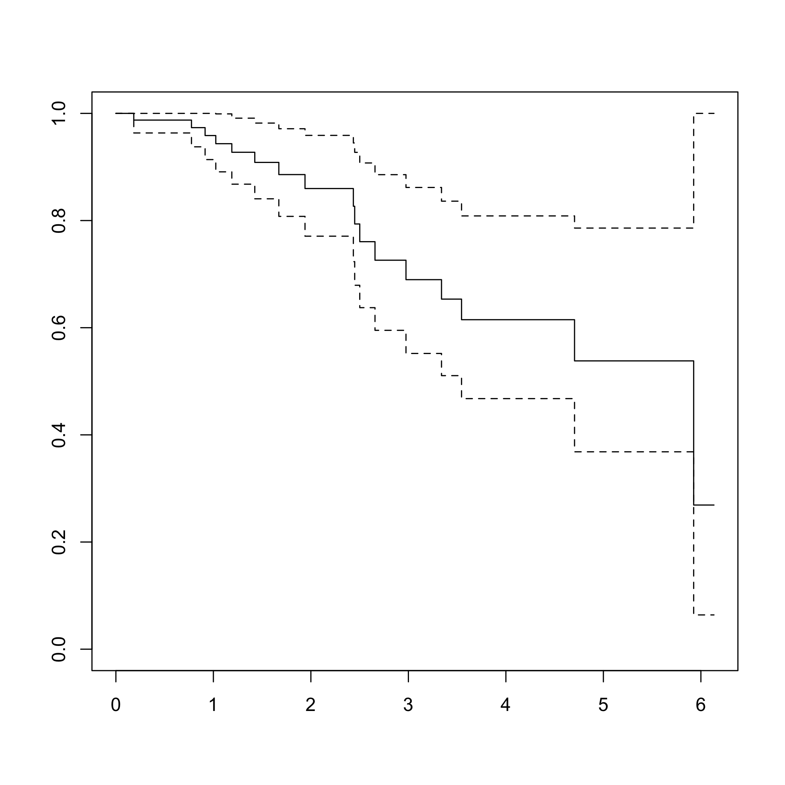
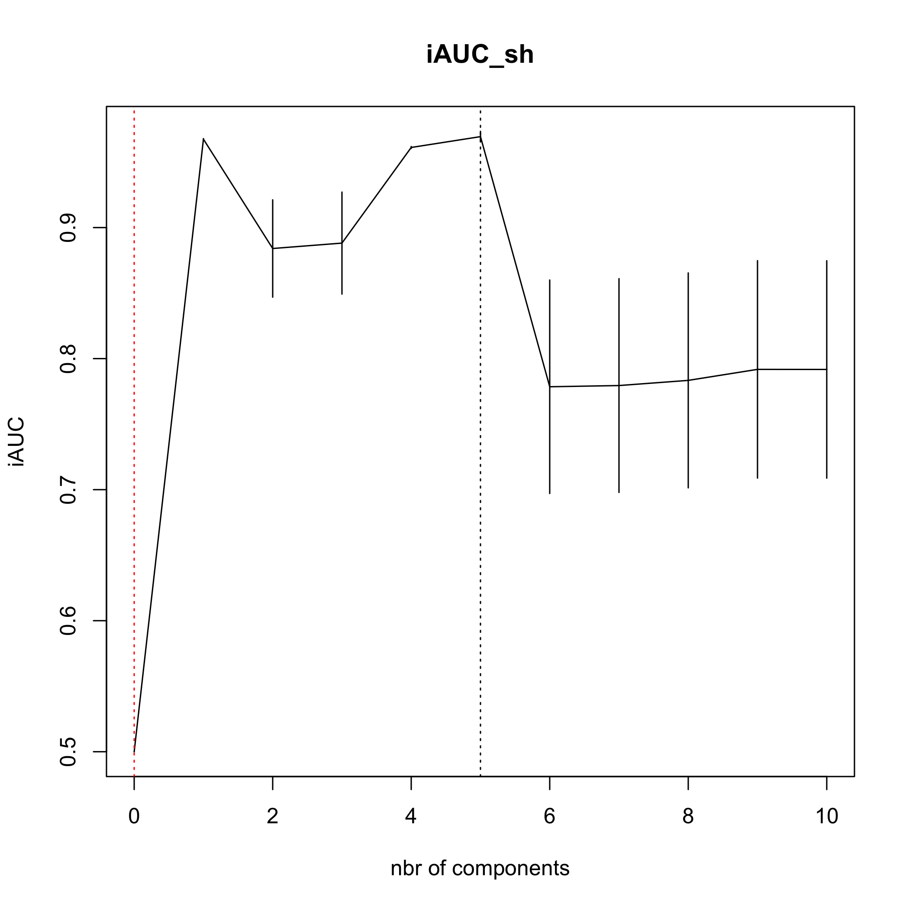

<!-- README.md is generated from README.Rmd. Please edit that file -->


# plsRcox 

# plsRcox, Cox-Models in a High Dimensional Setting in R
## Frédéric Bertrand and Myriam Maumy-Bertrand

<!-- badges: start -->
[](https://lifecycle.r-lib.org/articles/stages.html)
[](https://www.repostatus.org/#active)
[](https://github.com/fbertran/plsRcox/actions)
[](https://codecov.io/gh/fbertran/plsRcox?branch=master)
[](https://cran.r-project.org/package=plsRcox)
[](https://cran.r-project.org/package=plsRcox)
[](https://github.com/fbertran/plsRcox)
[](https://zenodo.org/badge/latestdoi/18454102)
<!-- badges: end -->


The goal of plsRcox is provide Cox models in a high dimensional setting in R.


plsRcox implements partial least squares Regression and various regular, sparse or kernel, techniques for fitting Cox models in high dimensional settings <https://doi.org/10.1093/bioinformatics/btu660>, Bastien, P., Bertrand, F., Meyer N., Maumy-Bertrand, M. (2015), Deviance residuals-based sparse PLS and sparse kernel PLS regression for censored data, Bioinformatics, 31(3):397-404. Cross validation criteria were studied in [<arXiv:1810.02962>](https://arxiv.org/abs/1810.01005), Bertrand, F., Bastien, Ph. and Maumy-Bertrand, M. (2018), Cross validating extensions of kernel, sparse or regular partial least squares regression models to censored data.


The package was presented at the [User2014!](http://user2014.r-project.org/) conference. Frédéric Bertrand, Philippe Bastien, Nicolas Meyer and Myriam Bertrand (2014). "plsRcox, Cox-Models in a high dimensional setting in R", *book of abstracts*, User2014!, Los Angeles, page 177,
<http://user2014.r-project.org/abstracts/posters/177_Bertrand.pdf>.


The plsRcox package contains an original allelotyping dataset from "Allelotyping identification of genomic alterations in rectal chromosomally unstable tumors without preoperative treatment", Benoît Romain, Agnès Neuville, Nicolas Meyer, Cécile Brigand, Serge Rohr, Anne Schneider, Marie-Pierre Gaub and Dominique Guenot (2010), *BMC Cancer*, **10**:561, <https://doi.org/10.1186/1471-2407-10-561>.


Support for parallel computation and GPU is being developped.


The package provides several modelling techniques related to penalized Cox models or extensions of partial least squares to Cox models. The first two were new algorithms.

- **coxsplsDR** and **cv.coxsplsDR** (Philippe Bastien, Frederic Bertrand, Nicolas Meyer, and Myriam Maumy-Bertrand (2015), "Deviance residuals-based sparse PLS and sparse kernel PLS regression for censored data", *Bioinformatics*, **31**(3):397-404, <https://doi.org/10.1093/bioinformatics/btu660>),

- **coxDKsplsDR** and **cv.coxDKsplsDR** (Philippe Bastien, Frederic Bertrand, Nicolas Meyer, and Myriam Maumy-Bertrand (2015), "Deviance residuals-based sparse PLS and sparse kernel PLS regression for censored data", *Bioinformatics*, **31**(3):397-404, <https://doi.org/10.1093/bioinformatics/btu660>),

- **coxDKplsDR** and **cv.coxDKplsDR** (Philippe Bastien (2008), "Deviance residuals based PLS regression for censored data in high dimensional setting", *Chemometrics and Intelligent Laboratory Systems*, **91**:78–86, <https://doi.org/10.1016/j.chemolab.2007.09.009>),

- **coxpls** and **cv.coxpls** (Nguyen, D.V., Rocke, D.M. (2002), "Partial least squares proportional hazard regression for application to DNA microarray survival data", *Bioinformatics*, **18**(12):1625–1632),

- **coxplsDR** and **cv.coxplsDR** (Philippe Bastien (2008), "Deviance residuals based PLS regression for censored data in high dimensional setting", *Chemometrics and Intelligent Laboratory Systems*, **91**:78–86, <https://doi.org/10.1016/j.chemolab.2007.09.009>),

- **DKplsRcox**,

- **larsDR** and **cv.larsDR** (Segal, M.R. (2006), "Microarray Gene Expression Data with Linked Survival Phenotypes: Diffuse large-B- Cell Lymphoma Revisited", *Biostatistics*, **7**:268-285, <https://doi.org/10.1093/biostatistics/kxj006>),

- **plsRcox** and **cv.plsRcox** (Philippe Bastien, Vincenzo Esposito Vinzi, and Michel Tenenhaus (2005), "PLS generalised linear regression", *Computational Statistics & Data Analysis*, **48**(1):17–46, <https://doi.org/10.1016/j.csda.2004.02.005>),

- **autoplsRcox** and **cv.autoplsRcox** (Philippe Bastien, Vincenzo Esposito Vinzi, and Michel Tenenhaus (2005), "PLS generalised linear regression", *Computational Statistics & Data Analysis*, **48**(1):17–46, <https://doi.org/10.1016/j.csda.2004.02.005>),


This website and these examples were created by F. Bertrand and M. Maumy-Bertrand.

## Installation

You can install the released version of plsRcox from [CRAN](https://CRAN.R-project.org) with:


```r
install.packages("plsRcox")
```

You can install the development version of plsRcox from [github](https://github.com) with:


```r
devtools::install_github("fbertran/plsRcox")
```

## Example

### The original allelotyping dataset


```r
library(plsRcox)
data(micro.censure)
Y_train_micro <- micro.censure$survyear[1:80]
C_train_micro <- micro.censure$DC[1:80]
Y_test_micro <- micro.censure$survyear[81:117]
C_test_micro <- micro.censure$DC[81:117]

data(Xmicro.censure_compl_imp)
X_train_micro <- apply((as.matrix(Xmicro.censure_compl_imp)),FUN="as.numeric",MARGIN=2)[1:80,]
X_train_micro_df <- data.frame(X_train_micro)
```

Compute deviance residuals with some options.


```r
DR_coxph(Y_train_micro,C_train_micro,plot=TRUE)
```


```
#>           1           2           3           4           5 
#> -1.48432960 -0.54695398 -0.23145502 -0.34003013 -0.97633722 
#>           6           7           8           9          10 
#> -0.38667660 -0.38667660  1.57418914 -0.54695398 -0.15811388 
#>          11          12          13          14          15 
#>  2.10405254 -0.23145502 -0.38667660 -1.09692040 -0.15811388 
#>          16          17          18          19          20 
#> -0.15811388 -0.54695398 -0.38667660  0.65978609 -1.09692040 
#>          21          22          23          24          25 
#> -0.43627414 -0.28961087 -0.38667660 -0.97633722 -1.09692040 
#>          26          27          28          29          30 
#> -0.15811388 -0.43627414 -0.43627414 -0.38667660 -0.23145502 
#>          31          32          33          34          35 
#>  2.30072697 -0.49023986 -0.54695398 -0.73444882  1.31082939 
#>          36          37          38          39          40 
#> -0.97633722  1.70134282 -0.54695398 -0.15811388  1.07714870 
#>          41          42          43          44          45 
#> -0.15811388 -0.49023986 -0.34003013 -0.97633722 -0.15811388 
#>          46          47          48          49          50 
#> -0.91410465 -1.09692040 -0.43627414 -0.38667660 -0.09836581 
#>          51          52          53          54          55 
#> -0.79392956  0.46851068 -0.34003013  1.95366297  2.60558118 
#>          56          57          58          59          60 
#> -0.54695398 -1.09692040 -0.15811388 -0.49023986 -0.97633722 
#>          61          62          63          64          65 
#> -0.28961087  1.44879795  1.82660327 -0.38667660  0.96936094 
#>          66          67          68          69          70 
#> -0.15811388 -0.43627414 -0.49023986  1.18850436 -0.97633722 
#>          71          72          73          74          75 
#> -0.97633722  0.86322194 -0.43627414 -0.49023986 -0.38667660 
#>          76          77          78          79          80 
#>  0.76231394 -0.97633722 -0.43627414 -0.54695398 -0.43627414
```

```r
DR_coxph(Y_train_micro,C_train_micro,scaleY=FALSE,plot=TRUE)
```


```
#>           1           2           3           4           5 
#> -1.48432960 -0.54695398 -0.23145502 -0.34003013 -0.97633722 
#>           6           7           8           9          10 
#> -0.38667660 -0.38667660  1.57418914 -0.54695398 -0.15811388 
#>          11          12          13          14          15 
#>  2.10405254 -0.23145502 -0.38667660 -1.09692040 -0.15811388 
#>          16          17          18          19          20 
#> -0.15811388 -0.54695398 -0.38667660  0.65978609 -1.09692040 
#>          21          22          23          24          25 
#> -0.43627414 -0.28961087 -0.38667660 -0.97633722 -1.09692040 
#>          26          27          28          29          30 
#> -0.15811388 -0.43627414 -0.43627414 -0.38667660 -0.23145502 
#>          31          32          33          34          35 
#>  2.30072697 -0.49023986 -0.54695398 -0.73444882  1.31082939 
#>          36          37          38          39          40 
#> -0.97633722  1.70134282 -0.54695398 -0.15811388  1.07714870 
#>          41          42          43          44          45 
#> -0.15811388 -0.49023986 -0.34003013 -0.97633722 -0.15811388 
#>          46          47          48          49          50 
#> -0.91410465 -1.09692040 -0.43627414 -0.38667660 -0.09836581 
#>          51          52          53          54          55 
#> -0.79392956  0.46851068 -0.34003013  1.95366297  2.60558118 
#>          56          57          58          59          60 
#> -0.54695398 -1.09692040 -0.15811388 -0.49023986 -0.97633722 
#>          61          62          63          64          65 
#> -0.28961087  1.44879795  1.82660327 -0.38667660  0.96936094 
#>          66          67          68          69          70 
#> -0.15811388 -0.43627414 -0.49023986  1.18850436 -0.97633722 
#>          71          72          73          74          75 
#> -0.97633722  0.86322194 -0.43627414 -0.49023986 -0.38667660 
#>          76          77          78          79          80 
#>  0.76231394 -0.97633722 -0.43627414 -0.54695398 -0.43627414
```

```r
DR_coxph(Y_train_micro,C_train_micro,scaleY=TRUE,plot=TRUE)
```



```
#>           1           2           3           4           5 
#> -1.48432960 -0.54695398 -0.23145502 -0.34003013 -0.97633722 
#>           6           7           8           9          10 
#> -0.38667660 -0.38667660  1.57418914 -0.54695398 -0.15811388 
#>          11          12          13          14          15 
#>  2.10405254 -0.23145502 -0.38667660 -1.09692040 -0.15811388 
#>          16          17          18          19          20 
#> -0.15811388 -0.54695398 -0.38667660  0.65978609 -1.09692040 
#>          21          22          23          24          25 
#> -0.43627414 -0.28961087 -0.38667660 -0.97633722 -1.09692040 
#>          26          27          28          29          30 
#> -0.15811388 -0.43627414 -0.43627414 -0.38667660 -0.23145502 
#>          31          32          33          34          35 
#>  2.30072697 -0.49023986 -0.54695398 -0.73444882  1.31082939 
#>          36          37          38          39          40 
#> -0.97633722  1.70134282 -0.54695398 -0.15811388  1.07714870 
#>          41          42          43          44          45 
#> -0.15811388 -0.49023986 -0.34003013 -0.97633722 -0.15811388 
#>          46          47          48          49          50 
#> -0.91410465 -1.09692040 -0.43627414 -0.38667660 -0.09836581 
#>          51          52          53          54          55 
#> -0.79392956  0.46851068 -0.34003013  1.95366297  2.60558118 
#>          56          57          58          59          60 
#> -0.54695398 -1.09692040 -0.15811388 -0.49023986 -0.97633722 
#>          61          62          63          64          65 
#> -0.28961087  1.44879795  1.82660327 -0.38667660  0.96936094 
#>          66          67          68          69          70 
#> -0.15811388 -0.43627414 -0.49023986  1.18850436 -0.97633722 
#>          71          72          73          74          75 
#> -0.97633722  0.86322194 -0.43627414 -0.49023986 -0.38667660 
#>          76          77          78          79          80 
#>  0.76231394 -0.97633722 -0.43627414 -0.54695398 -0.43627414
```

### coxsplsDR


```r
(cox_splsDR_fit=coxsplsDR(X_train_micro,Y_train_micro,C_train_micro,ncomp=6,eta=.5))
#> Call:
#> coxph(formula = YCsurv ~ ., data = tt_splsDR)
#> 
#>         coef exp(coef) se(coef)     z        p
#> dim.1 0.8093    2.2462   0.2029 3.989 6.63e-05
#> dim.2 0.9295    2.5333   0.2939 3.163  0.00156
#> dim.3 0.9968    2.7096   0.4190 2.379  0.01736
#> dim.4 0.9705    2.6391   0.3793 2.558  0.01052
#> dim.5 0.2162    1.2413   0.2811 0.769  0.44192
#> dim.6 0.4380    1.5496   0.3608 1.214  0.22473
#> 
#> Likelihood ratio test=55.06  on 6 df, p=4.51e-10
#> n= 80, number of events= 17

(cox_splsDR_fit2=coxsplsDR(~X_train_micro,Y_train_micro,C_train_micro,ncomp=6,eta=.5,trace=TRUE))
#> The variables that join the set of selected variables at each step:
#> - 1th step (K=1):
#> X_train_microD20S107 X_train_microD5S346 X_train_microD1S225 X_train_microD3S1282 X_train_microD15S127 X_train_microD1S207 X_train_microD2S138 X_train_microD10S191 X_train_microD14S65 X_train_microD4S414
#> X_train_microD16S408 X_train_microT X_train_microN X_train_microSTADE
#> - 2th step (K=2):
#> X_train_microD22S928 X_train_microD16S422 X_train_microD3S1283 X_train_microAgediag X_train_microM
#> - 3th step (K=3):
#> X_train_microD1S305 X_train_microD8S283 X_train_microD10S192 X_train_microsexe X_train_microSiege
#> - 4th step (K=4):
#> X_train_microD17S794 X_train_microD13S173 X_train_microTP53 X_train_microD6S264 X_train_microD2S159 X_train_microD6S275
#> - 5th step (K=5):
#> X_train_microD18S61 X_train_microD9S171 X_train_microD8S264 X_train_microD18S53 X_train_microD4S394 X_train_microD11S916
#> - 6th step (K=6):
#> X_train_microD17S790
#> Call:
#> coxph(formula = YCsurv ~ ., data = tt_splsDR)
#> 
#>         coef exp(coef) se(coef)     z        p
#> dim.1 0.8093    2.2462   0.2029 3.989 6.63e-05
#> dim.2 0.9295    2.5333   0.2939 3.163  0.00156
#> dim.3 0.9968    2.7096   0.4190 2.379  0.01736
#> dim.4 0.9705    2.6391   0.3793 2.558  0.01052
#> dim.5 0.2162    1.2413   0.2811 0.769  0.44192
#> dim.6 0.4380    1.5496   0.3608 1.214  0.22473
#> 
#> Likelihood ratio test=55.06  on 6 df, p=4.51e-10
#> n= 80, number of events= 17

(cox_splsDR_fit3=coxsplsDR(~.,Y_train_micro,C_train_micro,ncomp=6,
dataXplan=X_train_micro_df,eta=.5))
#> Call:
#> coxph(formula = YCsurv ~ ., data = tt_splsDR)
#> 
#>         coef exp(coef) se(coef)     z        p
#> dim.1 0.8093    2.2462   0.2029 3.989 6.63e-05
#> dim.2 0.9295    2.5333   0.2939 3.163  0.00156
#> dim.3 0.9968    2.7096   0.4190 2.379  0.01736
#> dim.4 0.9705    2.6391   0.3793 2.558  0.01052
#> dim.5 0.2162    1.2413   0.2811 0.769  0.44192
#> dim.6 0.4380    1.5496   0.3608 1.214  0.22473
#> 
#> Likelihood ratio test=55.06  on 6 df, p=4.51e-10
#> n= 80, number of events= 17

rm(cox_splsDR_fit,cox_splsDR_fit2,cox_splsDR_fit3)
```

### cv.coxsplsDR


```r
set.seed(123456)

(cv.coxsplsDR.res=cv.coxsplsDR(list(x=X_train_micro,time=Y_train_micro, status=C_train_micro),nt=10,eta=.1))
#> CV Fold 1 
#> CV Fold 2 
#> CV Fold 3 
#> CV Fold 4 
#> CV Fold 5
```


```
#> $nt
#> [1] 10
#> 
#> $cv.error10
#>  [1] 0.5000000 0.6773894 0.6493620 0.6641847 0.6240118 0.6442501 0.6368322
#>  [8] 0.6286337 0.6116994 0.6125641 0.6488137
#> 
#> $cv.se10
#>  [1] 0.00000000 0.02579921 0.04338024 0.03888348 0.04730986 0.04581284
#>  [7] 0.05021484 0.04737293 0.05050230 0.04570564 0.04490152
#> 
#> $folds
#> $folds$`1`
#>  [1] 64 15 56 59 10 39 70  4 80 16 37 33 50 51 78 44
#> 
#> $folds$`2`
#>  [1] 60 40 41 57  5 61 43 42 29 20 32 68  1 36 55 17
#> 
#> $folds$`3`
#>  [1] 31  8 62 13 73 47 71 46 35 69 75 26 74 65 58 63
#> 
#> $folds$`4`
#>  [1] 27 72 79 21 67 45  6 30 11 22 24 53 23  2 49  7
#> 
#> $folds$`5`
#>  [1] 28 12 66 48 77  9 38 25 19 54 34 52  3 14 76 18
#> 
#> 
#> $lambda.min10
#> [1] 1
#> 
#> $lambda.1se10
#> [1] 0
#> 
#> $nzb
#>  [1]  0 32 37 40 40 40 40 40 40 40 40
```


### coxDKsplsDR


```r
(cox_DKsplsDR_fit=coxDKsplsDR(X_train_micro,Y_train_micro,C_train_micro,ncomp=6, validation="CV",eta=.5))
#> 
#> Loaded mixOmics 6.6.0
#> 
#> Thank you for using mixOmics! Learn how to apply our methods with our tutorials on www.mixOmics.org, vignette and bookdown on  https://github.com/mixOmicsTeam/mixOmics
#> Questions: email us at mixomics[at]math.univ-toulouse.fr  
#> Bugs, Issues? https://github.com/mixOmicsTeam/mixOmics/issues
#> Cite us:  citation('mixOmics')
#> Kernel :  rbfdot 
#> Estimated_sigma  0.01224473
#> Call:
#> coxph(formula = YCsurv ~ ., data = tt_DKsplsDR)
#> 
#>            coef exp(coef)  se(coef)     z       p
#> dim.1 3.637e+00 3.797e+01 1.246e+00 2.919 0.00351
#> dim.2 9.920e+00 2.033e+04 3.303e+00 3.003 0.00267
#> dim.3 6.502e+00 6.668e+02 2.579e+00 2.521 0.01170
#> dim.4 1.467e+01 2.342e+06 4.854e+00 3.021 0.00252
#> dim.5 6.109e+00 4.497e+02 2.759e+00 2.214 0.02682
#> dim.6 1.249e+01 2.666e+05 4.980e+00 2.509 0.01212
#> 
#> Likelihood ratio test=69.58  on 6 df, p=4.977e-13
#> n= 80, number of events= 17

(cox_DKsplsDR_fit=coxDKsplsDR(~X_train_micro,Y_train_micro,C_train_micro,ncomp=6, validation="CV",eta=.5))
#> 
#> Loaded mixOmics 6.6.0
#> 
#> Thank you for using mixOmics! Learn how to apply our methods with our tutorials on www.mixOmics.org, vignette and bookdown on  https://github.com/mixOmicsTeam/mixOmics
#> Questions: email us at mixomics[at]math.univ-toulouse.fr  
#> Bugs, Issues? https://github.com/mixOmicsTeam/mixOmics/issues
#> Cite us:  citation('mixOmics')
#> Kernel :  rbfdot 
#> Estimated_sigma  0.01198748
#> Call:
#> coxph(formula = YCsurv ~ ., data = tt_DKsplsDR)
#> 
#>            coef exp(coef)  se(coef)     z        p
#> dim.1 2.649e+00 1.414e+01 1.206e+00 2.197 0.028012
#> dim.2 1.004e+01 2.304e+04 2.861e+00 3.511 0.000447
#> dim.3 6.887e+00 9.791e+02 2.476e+00 2.782 0.005404
#> dim.4 1.166e+01 1.160e+05 3.821e+00 3.052 0.002274
#> dim.5 8.334e+00 4.164e+03 4.227e+00 1.971 0.048674
#> dim.6 5.721e+00 3.051e+02 2.425e+00 2.359 0.018313
#> 
#> Likelihood ratio test=64.42  on 6 df, p=5.67e-12
#> n= 80, number of events= 17

(cox_DKsplsDR_fit=coxDKsplsDR(~.,Y_train_micro,C_train_micro,ncomp=6,
validation="CV",dataXplan=data.frame(X_train_micro),eta=.5))
#> 
#> Loaded mixOmics 6.6.0
#> 
#> Thank you for using mixOmics! Learn how to apply our methods with our tutorials on www.mixOmics.org, vignette and bookdown on  https://github.com/mixOmicsTeam/mixOmics
#> Questions: email us at mixomics[at]math.univ-toulouse.fr  
#> Bugs, Issues? https://github.com/mixOmicsTeam/mixOmics/issues
#> Cite us:  citation('mixOmics')
#> Kernel :  rbfdot 
#> Estimated_sigma  0.0131134
#> Call:
#> coxph(formula = YCsurv ~ ., data = tt_DKsplsDR)
#> 
#>            coef exp(coef)  se(coef)     z       p
#> dim.1 4.409e+00 8.218e+01 1.449e+00 3.043 0.00234
#> dim.2 9.764e+00 1.739e+04 3.227e+00 3.025 0.00248
#> dim.3 6.298e+00 5.434e+02 2.382e+00 2.644 0.00819
#> dim.4 1.491e+01 2.994e+06 4.781e+00 3.119 0.00182
#> dim.5 4.592e+00 9.865e+01 2.267e+00 2.025 0.04284
#> dim.6 6.985e+00 1.080e+03 3.048e+00 2.291 0.02194
#> 
#> Likelihood ratio test=69.14  on 6 df, p=6.149e-13
#> n= 80, number of events= 17

rm(cox_DKsplsDR_fit)
```

### cv.coxsplsDR


```r
set.seed(123456)

(cv.coxDKsplsDR.res=cv.coxDKsplsDR(list(x=X_train_micro,time=Y_train_micro, status=C_train_micro),nt=10,eta=.1))
#> 
#> Loaded mixOmics 6.6.0
#> 
#> Thank you for using mixOmics! Learn how to apply our methods with our tutorials on www.mixOmics.org, vignette and bookdown on  https://github.com/mixOmicsTeam/mixOmics
#> Questions: email us at mixomics[at]math.univ-toulouse.fr  
#> Bugs, Issues? https://github.com/mixOmicsTeam/mixOmics/issues
#> Cite us:  citation('mixOmics')
#> Kernel :  rbfdot 
#> Estimated_sigma  0.01186138 
#> CV Fold 1
#> 
#> Loaded mixOmics 6.6.0
#> 
#> Thank you for using mixOmics! Learn how to apply our methods with our tutorials on www.mixOmics.org, vignette and bookdown on  https://github.com/mixOmicsTeam/mixOmics
#> Questions: email us at mixomics[at]math.univ-toulouse.fr  
#> Bugs, Issues? https://github.com/mixOmicsTeam/mixOmics/issues
#> Cite us:  citation('mixOmics')
#> Kernel :  rbfdot 
#> Estimated_sigma  0.0123956 
#> CV Fold 2
#> 
#> Loaded mixOmics 6.6.0
#> 
#> Thank you for using mixOmics! Learn how to apply our methods with our tutorials on www.mixOmics.org, vignette and bookdown on  https://github.com/mixOmicsTeam/mixOmics
#> Questions: email us at mixomics[at]math.univ-toulouse.fr  
#> Bugs, Issues? https://github.com/mixOmicsTeam/mixOmics/issues
#> Cite us:  citation('mixOmics')
#> Kernel :  rbfdot 
#> Estimated_sigma  0.01263568 
#> CV Fold 3
#> 
#> Loaded mixOmics 6.6.0
#> 
#> Thank you for using mixOmics! Learn how to apply our methods with our tutorials on www.mixOmics.org, vignette and bookdown on  https://github.com/mixOmicsTeam/mixOmics
#> Questions: email us at mixomics[at]math.univ-toulouse.fr  
#> Bugs, Issues? https://github.com/mixOmicsTeam/mixOmics/issues
#> Cite us:  citation('mixOmics')
#> Kernel :  rbfdot 
#> Estimated_sigma  0.01235948 
#> CV Fold 4
#> 
#> Loaded mixOmics 6.6.0
#> 
#> Thank you for using mixOmics! Learn how to apply our methods with our tutorials on www.mixOmics.org, vignette and bookdown on  https://github.com/mixOmicsTeam/mixOmics
#> Questions: email us at mixomics[at]math.univ-toulouse.fr  
#> Bugs, Issues? https://github.com/mixOmicsTeam/mixOmics/issues
#> Cite us:  citation('mixOmics')
#> Kernel :  rbfdot 
#> Estimated_sigma  0.01247944 
#> CV Fold 5
```


```
#> $nt
#> [1] 10
#> 
#> $cv.error10
#>  [1] 0.5000000 0.6452065 0.6390089 0.6596989 0.7176982 0.6872992 0.6713925
#>  [8] 0.6911991 0.5932097 0.6453234 0.6199085
#> 
#> $cv.se10
#>  [1] 0.00000000 0.01653815 0.04090982 0.03568890 0.04264094 0.04067596
#>  [7] 0.04617710 0.03699745 0.03283319 0.03716281 0.03878102
#> 
#> $folds
#> $folds$`1`
#>  [1] 64 15 56 59 10 39 70  4 80 16 37 33 50 51 78 44
#> 
#> $folds$`2`
#>  [1] 60 40 41 57  5 61 43 42 29 20 32 68  1 36 55 17
#> 
#> $folds$`3`
#>  [1] 31  8 62 13 73 47 71 46 35 69 75 26 74 65 58 63
#> 
#> $folds$`4`
#>  [1] 27 72 79 21 67 45  6 30 11 22 24 53 23  2 49  7
#> 
#> $folds$`5`
#>  [1] 28 12 66 48 77  9 38 25 19 54 34 52  3 14 76 18
#> 
#> 
#> $lambda.min10
#> [1] 4
#> 
#> $lambda.1se10
#> [1] 0
#> 
#> $nzb
#>  [1]  0 53 62 64 64 64 64 64 64 64 64
```


## plsRcox


```r
plsRcox(X_train_micro,time=Y_train_micro,event=C_train_micro,nt=5)
#> ____************************************************____
#> ____Component____ 1 ____
#> ____Component____ 2 ____
#> ____Component____ 3 ____
#> ____Component____ 4 ____
#> ____Component____ 5 ____
#> ____Predicting X without NA neither in X nor in Y____
#> ****________________________________________________****
#> Number of required components:
#> [1] 5
#> Number of successfully computed components:
#> [1] 5
#> Coefficients:
#>                [,1]
#> D18S61   0.68964919
#> D17S794 -1.14362392
#> D13S173  1.37632457
#> D20S107  4.96128745
#> TP53     1.68453950
#> D9S171  -1.46691252
#> D8S264   0.66710776
#> D5S346  -4.61338196
#> D22S928 -1.82005524
#> D18S53   0.79853646
#> D1S225  -1.46234986
#> D3S1282 -1.67925042
#> D15S127  3.92225537
#> D1S305  -2.29680161
#> D1S207   2.02539691
#> D2S138  -3.48975878
#> D16S422 -2.92189625
#> D9S179  -0.59484679
#> D10S191 -1.30136747
#> D4S394   1.34265359
#> D1S197  -0.75014044
#> D6S264   1.32746604
#> D14S65  -3.20882866
#> D17S790  0.55427680
#> D5S430   3.40654627
#> D3S1283  2.12510239
#> D4S414   2.73619967
#> D8S283   0.71955323
#> D11S916  1.45026508
#> D2S159   0.90293134
#> D16S408 -0.59719901
#> D6S275  -1.02204186
#> D10S192  1.14220367
#> sexe     0.67314561
#> Agediag  0.04908478
#> Siege   -0.41985924
#> T        2.70581463
#> N        2.47039973
#> M       -4.53213922
#> STADE    0.48221697
#> Information criteria and Fit statistics:
#>                 AIC       BIC
#> Nb_Comp_0 112.87990 112.87990
#> Nb_Comp_1  85.11075  87.49278
#> Nb_Comp_2  75.49537  80.25942
#> Nb_Comp_3  68.45852  75.60460
#> Nb_Comp_4  63.09284  72.62094
#> Nb_Comp_5  55.30567  67.21581

plsRcox(~X_train_micro,time=Y_train_micro,event=C_train_micro,nt=5)
#> ____************************************************____
#> ____Component____ 1 ____
#> ____Component____ 2 ____
#> ____Component____ 3 ____
#> ____Component____ 4 ____
#> ____Component____ 5 ____
#> ____Predicting X without NA neither in X nor in Y____
#> ****________________________________________________****
#> Number of required components:
#> [1] 5
#> Number of successfully computed components:
#> [1] 5
#> Coefficients:
#>                             [,1]
#> X_train_microD18S61   0.68964919
#> X_train_microD17S794 -1.14362392
#> X_train_microD13S173  1.37632457
#> X_train_microD20S107  4.96128745
#> X_train_microTP53     1.68453950
#> X_train_microD9S171  -1.46691252
#> X_train_microD8S264   0.66710776
#> X_train_microD5S346  -4.61338196
#> X_train_microD22S928 -1.82005524
#> X_train_microD18S53   0.79853646
#> X_train_microD1S225  -1.46234986
#> X_train_microD3S1282 -1.67925042
#> X_train_microD15S127  3.92225537
#> X_train_microD1S305  -2.29680161
#> X_train_microD1S207   2.02539691
#> X_train_microD2S138  -3.48975878
#> X_train_microD16S422 -2.92189625
#> X_train_microD9S179  -0.59484679
#> X_train_microD10S191 -1.30136747
#> X_train_microD4S394   1.34265359
#> X_train_microD1S197  -0.75014044
#> X_train_microD6S264   1.32746604
#> X_train_microD14S65  -3.20882866
#> X_train_microD17S790  0.55427680
#> X_train_microD5S430   3.40654627
#> X_train_microD3S1283  2.12510239
#> X_train_microD4S414   2.73619967
#> X_train_microD8S283   0.71955323
#> X_train_microD11S916  1.45026508
#> X_train_microD2S159   0.90293134
#> X_train_microD16S408 -0.59719901
#> X_train_microD6S275  -1.02204186
#> X_train_microD10S192  1.14220367
#> X_train_microsexe     0.67314561
#> X_train_microAgediag  0.04908478
#> X_train_microSiege   -0.41985924
#> X_train_microT        2.70581463
#> X_train_microN        2.47039973
#> X_train_microM       -4.53213922
#> X_train_microSTADE    0.48221697
#> Information criteria and Fit statistics:
#>                 AIC       BIC
#> Nb_Comp_0 112.87990 112.87990
#> Nb_Comp_1  85.11075  87.49278
#> Nb_Comp_2  75.49537  80.25942
#> Nb_Comp_3  68.45852  75.60460
#> Nb_Comp_4  63.09284  72.62094
#> Nb_Comp_5  55.30567  67.21581

plsRcox(Xplan=X_train_micro,time=Y_train_micro,event=C_train_micro,nt=5,sparse=TRUE, alpha.pvals.expli=.15)
#> ____************************************************____
#> ____Component____ 1 ____
#> ____Component____ 2 ____
#> ____Component____ 3 ____
#> Warning : 25 < 10^{-12}
#> Warning only 3 components could thus be extracted
#> ____Predicting X without NA neither in X nor in Y____
#> ****________________________________________________****
#> Number of required components:
#> [1] 5
#> Number of successfully computed components:
#> [1] 3
#> Coefficients:
#>                [,1]
#> D18S61   0.00000000
#> D17S794  0.00000000
#> D13S173  0.00000000
#> D20S107  2.22871454
#> TP53     0.00000000
#> D9S171   0.00000000
#> D8S264   0.00000000
#> D5S346  -1.20298526
#> D22S928  0.00000000
#> D18S53   0.00000000
#> D1S225  -1.29459798
#> D3S1282 -1.99426291
#> D15S127  1.39645601
#> D1S305   0.00000000
#> D1S207   1.25164327
#> D2S138  -1.65740160
#> D16S422  0.00000000
#> D9S179   0.00000000
#> D10S191 -1.25360805
#> D4S394   0.00000000
#> D1S197   0.00000000
#> D6S264   0.00000000
#> D14S65  -1.33587373
#> D17S790  0.00000000
#> D5S430   1.72799213
#> D3S1283  0.00000000
#> D4S414   1.03558702
#> D8S283   0.00000000
#> D11S916  0.00000000
#> D2S159   0.00000000
#> D16S408 -1.75748257
#> D6S275   0.00000000
#> D10S192  0.00000000
#> sexe     0.00000000
#> Agediag  0.05075304
#> Siege    0.00000000
#> T        1.36569407
#> N        1.27485618
#> M       -1.17682617
#> STADE   -0.65106093
#> Information criteria and Fit statistics:
#>                 AIC       BIC
#> Nb_Comp_0 112.87990 112.87990
#> Nb_Comp_1  85.54313  87.92516
#> Nb_Comp_2  75.16125  79.92530
#> Nb_Comp_3  73.63097  80.77705

plsRcox(Xplan=~X_train_micro,time=Y_train_micro,event=C_train_micro,nt=5,sparse=TRUE, alpha.pvals.expli=.15)
#> ____************************************************____
#> ____Component____ 1 ____
#> ____Component____ 2 ____
#> ____Component____ 3 ____
#> Warning : 25 < 10^{-12}
#> Warning only 3 components could thus be extracted
#> ____Predicting X without NA neither in X nor in Y____
#> ****________________________________________________****
#> Number of required components:
#> [1] 5
#> Number of successfully computed components:
#> [1] 3
#> Coefficients:
#>                             [,1]
#> X_train_microD18S61   0.00000000
#> X_train_microD17S794  0.00000000
#> X_train_microD13S173  0.00000000
#> X_train_microD20S107  2.22871454
#> X_train_microTP53     0.00000000
#> X_train_microD9S171   0.00000000
#> X_train_microD8S264   0.00000000
#> X_train_microD5S346  -1.20298526
#> X_train_microD22S928  0.00000000
#> X_train_microD18S53   0.00000000
#> X_train_microD1S225  -1.29459798
#> X_train_microD3S1282 -1.99426291
#> X_train_microD15S127  1.39645601
#> X_train_microD1S305   0.00000000
#> X_train_microD1S207   1.25164327
#> X_train_microD2S138  -1.65740160
#> X_train_microD16S422  0.00000000
#> X_train_microD9S179   0.00000000
#> X_train_microD10S191 -1.25360805
#> X_train_microD4S394   0.00000000
#> X_train_microD1S197   0.00000000
#> X_train_microD6S264   0.00000000
#> X_train_microD14S65  -1.33587373
#> X_train_microD17S790  0.00000000
#> X_train_microD5S430   1.72799213
#> X_train_microD3S1283  0.00000000
#> X_train_microD4S414   1.03558702
#> X_train_microD8S283   0.00000000
#> X_train_microD11S916  0.00000000
#> X_train_microD2S159   0.00000000
#> X_train_microD16S408 -1.75748257
#> X_train_microD6S275   0.00000000
#> X_train_microD10S192  0.00000000
#> X_train_microsexe     0.00000000
#> X_train_microAgediag  0.05075304
#> X_train_microSiege    0.00000000
#> X_train_microT        1.36569407
#> X_train_microN        1.27485618
#> X_train_microM       -1.17682617
#> X_train_microSTADE   -0.65106093
#> Information criteria and Fit statistics:
#>                 AIC       BIC
#> Nb_Comp_0 112.87990 112.87990
#> Nb_Comp_1  85.54313  87.92516
#> Nb_Comp_2  75.16125  79.92530
#> Nb_Comp_3  73.63097  80.77705
```

### cv.plsRcox


```r
set.seed(123456)

(cv.plsRcox.res=cv.plsRcox(list(x=X_train_micro,time=Y_train_micro,status=C_train_micro),nt=10,verbose = FALSE))
```



```
#> $nt
#> [1] 10
#> 
#> $cv.error5
#>  [1] 0.5000000 0.9680950 0.9682845 0.9678603 0.9577447 0.9674094 0.9685457
#>  [8] 0.9671530 0.9654175 0.9600213 0.9648240
#> 
#> $cv.se5
#>  [1] 5.551115e-18 3.934293e-04 6.577693e-04 2.996472e-03 1.929769e-03
#>  [6] 1.046829e-03 1.425160e-03 9.134268e-04 3.557709e-03 2.614560e-03
#> [11] 5.990163e-04
#> 
#> $folds
#> $folds$`1`
#>  [1] 64 15 56 59 10 39 70  4 80 16 37 33 50 51 78 44
#> 
#> $folds$`2`
#>  [1] 60 40 41 57  5 61 43 42 29 20 32 68  1 36 55 17
#> 
#> $folds$`3`
#>  [1] 31  8 62 13 73 47 71 46 35 69 75 26 74 65 58 63
#> 
#> $folds$`4`
#>  [1] 27 72 79 21 67 45  6 30 11 22 24 53 23  2 49  7
#> 
#> $folds$`5`
#>  [1] 28 12 66 48 77  9 38 25 19 54 34 52  3 14 76 18
#> 
#> 
#> $lambda.min5
#> [1] 6
#> 
#> $lambda.1se5
#> [1] 0
```

## DKplsRcox


```r
DKplsRcox(X_train_micro,time=Y_train_micro,event=C_train_micro,nt=5)
#> Kernel :  rbfdot 
#> Estimated_sigma  0.01224473 
#> ____************************************************____
#> ____Component____ 1 ____
#> ____Component____ 2 ____
#> ____Component____ 3 ____
#> ____Component____ 4 ____
#> ____Component____ 5 ____
#> ____Predicting X without NA neither in X nor in Y____
#> ****________________________________________________****
#> Call:
#> coxph(formula = YCsurv ~ ., data = tt_DKplsRcox)
#> 
#>              coef  exp(coef)   se(coef)      z        p
#> Comp_1 -8.697e+00  1.670e-04  3.130e+00 -2.779 0.005450
#> Comp_2  2.689e+01  4.753e+11  7.117e+00  3.778 0.000158
#> Comp_3  2.097e+01  1.283e+09  5.799e+00  3.617 0.000299
#> Comp_4  9.230e+00  1.020e+04  3.050e+00  3.026 0.002475
#> Comp_5  8.445e+00  4.653e+03  2.626e+00  3.216 0.001302
#> 
#> Likelihood ratio test=69.98  on 5 df, p=1.033e-13
#> n= 80, number of events= 17

DKplsRcox(~X_train_micro,time=Y_train_micro,event=C_train_micro,nt=5)
#> Kernel :  rbfdot 
#> Estimated_sigma  0.01198748 
#> ____************************************************____
#> ____Component____ 1 ____
#> ____Component____ 2 ____
#> ____Component____ 3 ____
#> ____Component____ 4 ____
#> ____Component____ 5 ____
#> ____Predicting X without NA neither in X nor in Y____
#> ****________________________________________________****
#> Call:
#> coxph(formula = YCsurv ~ ., data = tt_DKplsRcox)
#> 
#>              coef  exp(coef)   se(coef)      z        p
#> Comp_1 -9.302e+00  9.124e-05  3.258e+00 -2.855 0.004307
#> Comp_2  2.708e+01  5.780e+11  7.138e+00  3.794 0.000148
#> Comp_3  2.083e+01  1.108e+09  5.742e+00  3.627 0.000287
#> Comp_4  8.959e+00  7.774e+03  2.982e+00  3.004 0.002663
#> Comp_5  8.369e+00  4.311e+03  2.610e+00  3.207 0.001343
#> 
#> Likelihood ratio test=69.46  on 5 df, p=1.328e-13
#> n= 80, number of events= 17

DKplsRcox(Xplan=X_train_micro,time=Y_train_micro,event=C_train_micro,nt=5,sparse=TRUE, alpha.pvals.expli=.15)
#> Kernel :  rbfdot 
#> Estimated_sigma  0.0131134 
#> ____************************************************____
#> ____Component____ 1 ____
#> ____Component____ 2 ____
#> ____Component____ 3 ____
#> ____Component____ 4 ____
#> ____Component____ 5 ____
#> ____Predicting X without NA neither in X nor in Y____
#> ****________________________________________________****
#> Call:
#> coxph(formula = YCsurv ~ ., data = tt_DKplsRcox)
#> 
#>              coef  exp(coef)   se(coef)      z        p
#> Comp_1 -6.302e+01  4.283e-28  1.917e+01 -3.288 0.001009
#> Comp_2  9.190e+01  8.127e+39  2.721e+01  3.377 0.000732
#> Comp_3  4.391e+01  1.179e+19  1.319e+01  3.330 0.000867
#> Comp_4  4.459e+01  2.320e+19  1.415e+01  3.151 0.001629
#> Comp_5  9.395e+00  1.202e+04  3.430e+00  2.739 0.006166
#> 
#> Likelihood ratio test=81.58  on 5 df, p=3.921e-16
#> n= 80, number of events= 17

DKplsRcox(Xplan=~X_train_micro,time=Y_train_micro,event=C_train_micro,nt=5,sparse=TRUE, alpha.pvals.expli=.15)
#> Kernel :  rbfdot 
#> Estimated_sigma  0.01252998 
#> ____************************************************____
#> ____Component____ 1 ____
#> ____Component____ 2 ____
#> ____Component____ 3 ____
#> ____Component____ 4 ____
#> ____Component____ 5 ____
#> ____Predicting X without NA neither in X nor in Y____
#> ****________________________________________________****
#> Call:
#> coxph(formula = YCsurv ~ ., data = tt_DKplsRcox)
#> 
#>              coef  exp(coef)   se(coef)      z       p
#> Comp_1 -7.380e+01  8.860e-33  2.455e+01 -3.006 0.00264
#> Comp_2  1.108e+02  1.327e+48  3.640e+01  3.044 0.00233
#> Comp_3  4.924e+01  2.437e+21  1.627e+01  3.026 0.00248
#> Comp_4  5.359e+01  1.882e+23  1.800e+01  2.977 0.00291
#> Comp_5  1.116e+01  7.038e+04  4.011e+00  2.783 0.00539
#> 
#> Likelihood ratio test=83.79  on 5 df, p=< 2.2e-16
#> n= 80, number of events= 17
```
